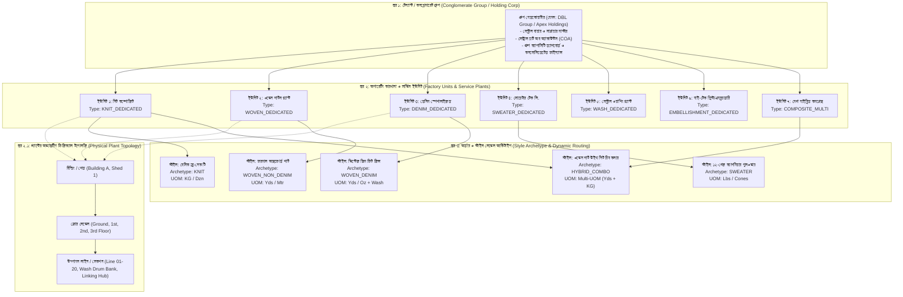
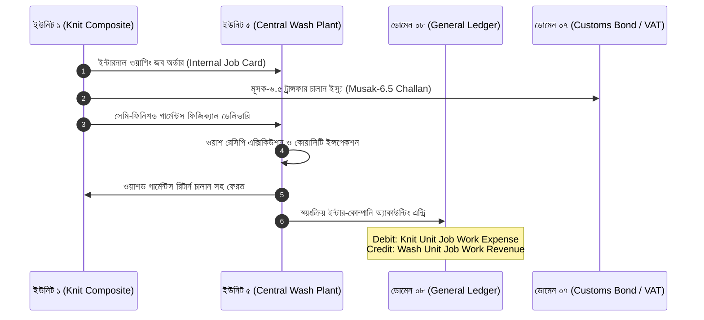

# 🏛️ থ্রেডফ্লো এন্টারপ্রাইজ ৩-টায়ার অর্গানাইজেশনাল মডেল ও মাল্টি-আর্কিটাইপ কনফিগারেশন
### *ThreadFlow 3-Tier Enterprise Modeling & Multi-Archetype Factory Architecture*

> **ডকুমেন্ট আইডি**: `TF-DOC-004-ENTERPRISE-MODELING`  
> **প্রণেতা**: 🏛️ তানভীর (Principal Architect), 📋 নাবিলা (Lead BA), 🗄️ ফাহিম (Database Architect), 🎨 সজীব (Frontend Craftsman)  
> **অনুমোদনকারী**: 👑 বস (Founder / CTO / Head of Engineering)  
> **স্ট্যাটাস**: অফিসিয়াল আর্কিটেকচারাল স্ট্যান্ডার্ড (১০০% লকড ও প্রোডাকশন-রেডি) | **ভার্সন**: 2.0.0

---

## ১. ভূমিকা ও কৌশলগত উদ্দেশ্য (Strategic Vision)

বাংলাদেশ ও দক্ষিণ এশিয়ার বৃহৎ পোশাক প্রস্তুতকারী গ্রুপগুলোতে (যেমন: DBL Group, Ha-Meem Group, Beximco, Pacific Jeans, Ananta Group) একই আমব্রেলা গ্রুপের অধীনে বিভিন্ন প্রকৃতির কারখানা ও স্বাধীন বাণিজ্যিক ওয়াশিং/প্রিন্টিং প্ল্যান্ট পরিচালিত হয়। বাজারে প্রচলিত গ্লোবাল ও লোকাল ইআরপিগুলোর প্রধান ব্যর্থতা হলো:
1. **একপেশে ডিজাইন (Single-Type Bias)**: সফটওয়্যারটি হয়তো শুধু নিটের জন্য তৈরি কিন্তু ওভেন শার্ট বা ডেনিম জিন্স চালাতে পারে না; অথবা শুধু ওভেনের জন্য তৈরি হওয়ায় নিটের জিএসএম (GSM), ফেব্রিক ডায়ামিটার (Dia), এবং কেজিতে কনজাম্পশন ক্যালকুলেট করতে পারে না।
2. **সোয়েটার সেক্টরের অবহেলা**: প্রচলিত সিস্টেমে সোয়েটার (Flat Knit / Jacquard) ফ্যাক্টরির কোনো জায়গাই থাকে না—কারণ সোয়েটারে ফেব্রিক রোল কেনা বা কাটিং টেবিল থাকে না; থাকে সরাসরি ইয়ার্ন কোন/পাউন্ড কেনা, ফ্ল্যাট নিটিং মেশিন (3GG-14GG), এবং ডায়াল লিঙ্কিং ফ্লোর।
3. **স্বাধীন ওয়াশিং ও প্রিন্টিং প্ল্যান্টের সমন্বয়হীনতা**: গ্রুপের অধীনে অনেক সময় স্বতন্ত্র বাণিজ্যিক ওয়াশিং বা প্রিন্টিং ফ্যাক্টরি থাকে, যা নিজস্ব কারখানার পাশাপাশি বাইরের কারখানার কাজও সাবকন্ট্রাক্টে করে। প্রচলিত ইআরপিতে এদের আলাদা ফ্যাক্টরি হিসেবে কনফিগার করার কোনো ফ্লেক্সিবিলিটি থাকে না।
4. **ইউজার ইন্টারফেসের বিশৃঙ্খলা (UI Clutter)**: যদি একটি সফটওয়্যারে সব ফিচার একসাথে ঢুকিয়ে দেওয়া হয়, তবে একটি একক নিট কারখানার মার্চেন্ডাইজার বা স্টোরকিপার ডেনিম ওয়াশ, স্টোন এনজাইম, বা সোয়েটার লিঙ্কিংয়ের শত শত অপ্রয়োজনীয় মেনু দেখে বিভ্রান্ত হয়।

**থ্রেডফ্লো ইআরপির সমাধান**: **"৩-টায়ার এন্টারপ্রাইজ মডেলিং (3-Tier Hierarchy)"**। এর মাধ্যমে একই সফটওয়্যার প্ল্যাটফর্ম গ্রুপ লেভেলে সেন্ট্রালাইজড থাকবে, কিন্তু প্রতিটি কারখানা তৈরির সময় তার অপারেটিং টাইপ ডিক্লেয়ার করার মাধ্যমে অপ্রয়োজনীয় সব মেনু ও জটিলতা স্বয়ংক্রিয়ভাবে হাইড থাকবে—অথচ ব্যাকএন্ডে থাকবে শতভাগ ডেটা ইন্টিগ্রিটি, ফিজিক্যাল ফ্লোর টপোলজি এবং ক্রস-প্ল্যান্ট ইন্টারকানেক্টিভিটি।

---

## ২. ৩-টায়ার এন্টারপ্রাইজ কাঠামোর আর্কিটেকচারাল নকশা (The 3-Tier Hierarchy)

থ্রেডফ্লো ইআরপির পুরো অর্গানাইজেশনাল স্ট্রাকচার ৩টি সুস্পষ্ট স্তরে (3 Tiers) বিভক্ত:



---

## ৩. বিস্তারিত স্তর বিবরণ (Tier-by-Tier Deep Dive)

### 🏢 স্তর ১: টেন্যান্ট / কনগ্লোমারেট গ্রুপ লেভেল (Conglomerate Group Level)
- **সংজ্ঞা**: এটি হলো মাল্টি-কোম্পানির অভিভাবক সত্তা (Parent Holding Entity)।
- **দায়িত্ব ও ক্ষমতা**:
  1. **গ্লোবাল মাস্টার ডেটা ম্যানেজমেন্ট**:
     - বায়ার ও ব্র্যান্ডের সেন্ট্রাল ডিরেক্টরি (যেমন: H&M, Zara, Walmart, Marks & Spencer)। একবার বায়ার এন্ট্রি হলে গ্রুপের যেকোনো ফ্যাক্টরি অর্ডার বুক করতে পারবে।
     - অনুমোদিত গ্লোবাল সাপ্লায়ার তালিকা (Approved Vendor List - AVL) ও তাদের আন্তর্জাতিক কমপ্লায়েন্স রেটিং।
     - সেন্ট্রাল কারেন্সি ও এক্সচেঞ্জ রেট টেবিল (USD, EUR, GBP, BDT - ডেইলি বাংলাদেশ ব্যাংক বা কমার্শিয়াল ব্যাংক রেট সিঙ্ক)।
  2. **কনসোলিডেটেড ফাইন্যান্সিয়াল অডিট (Group Balance Sheet)**:
     - প্রতিটি স্বতন্ত্র কারখানার ব্যালেন্সশিট ও পিঅ্যান্ডএল (P&L) আলাদা থাকবে, কিন্তু গ্রুপ সিএফও এক ক্লিকে সম্পূর্ণ কনগ্লোমারেটের সমন্বিত ব্যালেন্সশিট দেখতে পারবেন।
  3. **সেন্ট্রাল কমার্শিয়াল ও এল/সি হেজিং (Back-to-Back LC Pool)**:
     - মাস্টার এক্সপোর্ট এল/সির বিপরীতে একাধিক কারখানার ব্যাক-টু-ব্যাক এল/সি খোলা ও গ্রুপ ক্রেডিট লাইন ম্যানেজমেন্ট।
  4. **গ্রুপ ক্যাপাসিটি ও অর্ডার অ্যালোকেশন ড্যাশবোর্ড**:
     - টপ ম্যানেজমেন্ট দেখতে পারবে গ্রুপের কোন ইউনিটে লাইন খালি আছে এবং বায়ারের বড় অর্ডার কোন ইউনিটে ভাগ করে দিলে সবচেয়ে বেশি অন-টাইম ডেলিভারি নিশ্চিত হবে।

---

### 🏭 স্তর ২: অপারেটিং ফ্যাক্টরি ও সার্ভিস ইউনিট লেভেল (Factory Units & Service Plants)
- **সংজ্ঞা**: এটি হলো একটি বাস্তব ভৌগোলিক বা আইনি উৎপাদনকারী ইউনিট (Manufacturing Plant / Legal Subsidiary)।
- **ফ্যাক্টরি ক্রিয়েশনের সময় আবশ্যক ডিক্লেয়ারেশন (`operational_type`)**:
  যখন সিস্টেম অ্যাডমিন বা ম্যানেজমেন্ট নতুন একটি কারখানা রেজিস্টার করবে, তখন ড্রপডাউন থেকে ৭টি সুনির্দিষ্ট প্রোফাইলের যেকোনো একটি বেছে নেবে:

| ফ্যাক্টরি টাইপ কোড | কারখানার প্রকৃতি | সক্রিয় মডিউল ও ডেটা ফ্লো | স্বয়ংক্রিয়ভাবে হাইড হওয়া মডিউল (Zero UI Clutter) |
| :--- | :--- | :--- | :--- |
| **`KNIT_DEDICATED`** | একক বা কম্পোজিট নিট পোশাক কারখানা | - ইয়ার্ন ও সার্কুলার নিটিং<br/>- ডাইং ও ফিনিশিং রিসিভিং<br/>- ফেব্রিক রিল্যাক্সেশন (২৪-৪৮ ঘণ্টা)<br/>- কেজিতে ফেব্রিক হিসাব ও ডায়া/জিএসএম<br/>- ওভারলক/ফ্ল্যাটলক সুইং লাইন<br/>- এম্বেলিশমেন্ট (Domain 11) | - ডেনিম হেভি ওয়াশ প্ল্যান্ট (Domain 12)<br/>- ওভেন কলার ফিউজিং<br/>- সোয়েটার ইয়ার্ন উইন্ডিং ও ফ্ল্যাট নিটিং মেশিন<br/>- সোয়েটার লিঙ্কিং ফ্লোর |
| **`WOVEN_DEDICATED`** | ওভেন শার্ট, প্যান্ট, স্যুট বা ট্রাউজার কারখানা | - ইয়ার্ড/মিটারভিত্তিক রোল ইনভেন্টরি<br/>- উইডথ ও শেড লট ট্র্যাকিং (4-Point System)<br/>- ইন্টারলাইনিং ও কলার/কাফ ফিউজিং<br/>- সিঙ্গেল নিডেল লকস্টিচ সুইং<br/>- প্রেসার আয়রনিং ও ব্লিস্টার প্যাক | - সার্কুলার নিটিং ও ইয়ার্ন কাউন্ট ট্র্যাকিং<br/>- নিট রিল্যাক্সেশন ট্যাংক<br/>- হেভি ডেনিম ওয়াশ ড্রাম<br/>- সোয়েটার ফ্ল্যাট নিটিং ও লিঙ্কিং |
| **`DENIM_DEDICATED`** | স্পেশালাইজড ডেনিম বটমস ও জ্যাকেট প্ল্যান্ট | - হেভি আউন্স টুইল ফেব্রিক (10oz - 14.5oz)<br/>- প্রি-কাটিং ওয়াশ স্কেলিং ও প্যাটার্ন এক্সপেনশন<br/>- চেইনস্টিচ, ফিড-অফ-দ্য-আর্ম, রিভেট মেশিন<br/>- **ডোমেন ১২: সম্পূর্ণ ওয়াশিং প্ল্যান্ট** (হুইস্কার, ডেস্ট্রয়, স্টোন ওয়াশ, এনজাইম, ট্যাগিং, ওজোন, লেজার)<br/>- শেড ব্যান্ডিং অডিট (A, B, C গ্রুপিং) | - সোয়েটার নিটিং ও লিঙ্কিং<br/>- ফরমাল শার্ট কলার ফিউজিং<br/>- লাইটওয়েট নিট জিএসএম ট্র্যাকিং |
| **`SWEATER_DEDICATED`** | ফ্ল্যাট নিট / সোয়েটার ও পুলওভার কারখানা | - সরাসরি ইয়ার্ন কোন/পাউন্ড/কেজি রিসিভিং<br/>- ইয়ার্ন উইন্ডিং ও প্যারাফিন ওয়াক্সিং<br/>- ফ্ল্যাট নিটিং মেশিন এলোকেশন (Stoll, Shima Seiki 3GG-14GG)<br/>- প্যানেল ওয়েট অডিট ও ত্রুটি ইনস্পেকশন<br/>- লিঙ্কিং ফ্লোর (ডায়াল লিঙ্কিং মেশিন)<br/>- লাইট সোয়েটার মিলিং ও সফেনার ওয়াশ | - **ডোমেন ০৪: ফেব্রিক কাটিং টেবিল (সম্পূর্ণ অপ্রয়োজনীয়)**<br/>- সিএডি মার্কার ও লেইং<br/>- ফেব্রিক রোল ইনস্পেকশন মেশিন<br/>- ডেনিম ড্রাই প্রসেস |
| **`WASH_DEDICATED`** | স্বাধীন বাণিজ্যিক ওয়াশিং প্ল্যান্ট (Commercial Laundry) | - ডোমেন ১২-এর পূর্ণ নিয়ন্ত্রণ<br/>- ওয়াশ রেসিপি ও কেমিক্যাল ইনভেন্টরি<br/>- রোটারি ড্রাম, হাইড্রো এক্সট্রাক্টর, টাম্বলার ড্রায়ার<br/>- ড্রাই প্রসেস এরিয়া (হ্যান্ড স্যান্ডিং, হুইস্কার, ওজোন)<br/>- বায়ার শেড অ্যাপ্রুভাল ও ইটিপি (ETP) ডিসচার্জ ট্র্যাকিং | - ডোমেন ০১: মার্চেন্ডাইজিং স্টাইল কাটিং<br/>- ডোমেন ০৪: কাটিং টেবিল<br/>- ডোমেন ০৫: সুইং লাইন ও বান্ডেল ট্র্যাকিং |
| **`EMBELLISHMENT_DEDICATED`** | স্বাধীন বাণিজ্যিক প্রিন্টিং ও এমব্রয়ডারি কারখানা | - ডোমেন ১১-এর পূর্ণ নিয়ন্ত্রণ<br/>- স্ক্রিন/টেবিল প্রিন্ট, হাই-ডেনসিটি (HD), ডিজিটাল প্রিন্ট<br/>- মাল্টি-হেড এমব্রয়ডারি মেশিন (Tajima, Barudan)<br/>- কালার কিচেন, ডাইস ও কেমিক্যাল স্টক<br/>- রিকাট রিকুইজিশন ও প্যানেল কোয়ালিটি অডিট | - সুইং লাইন<br/>- ওয়াশিং প্ল্যান্ট ড্রাম<br/>- সোয়েটার ফ্ল্যাট নিটিং ও লিঙ্কিং |
| **`COMPOSITE_MULTI`** | মেগা কম্পোজিট পার্ক (সব ধরনের পোশাক তৈরি হয়) | - উপরে বর্ণিত সমস্ত ডোমেন ও সাব-মডিউল সক্রিয় থাকবে।<br/>- স্টাইল-লেভেল রাউটিংয়ের মাধ্যমে লাইন পরিচালিত হবে। | - কোনো ফিচার হাইড থাকবে না; ডায়নামিক স্টাইল আর্কিটাইপ অনুযায়ী লাইন চালিত হবে। |

---

### 🏗️ স্তর ২.১: প্ল্যান্টের অভ্যন্তরীণ ফিজিক্যাল টপোলজি (Physical Plant Topology Hierarchy)

বাস্তব কারখানায় একটি প্রোডাকশন লাইন বা মেশিন বাতাসে ভেসে থাকে না; তার সুনির্দিষ্ট ফিজিক্যাল অবস্থান থাকে। থ্রেডফ্লো এই বাস্তবতাকে নিচের ৪-স্তরের চেইনে আবদ্ধ করেছে:

$$\text{Factory Unit} \longrightarrow \text{Building / Shed} \longrightarrow \text{Floor Level} \longrightarrow \text{Line / Section / Table}$$

```
Factory Unit: "Apex Knit Composite Ltd."
  │
  ├── Building A: "Main Production Tower"
  │     ├── Ground Floor:
  │     │     ├── Fabric Store (Racks A1 - Z10)
  │     │     └── Trims Store (Bins 01 - 500)
  │     ├── 1st Floor:
  │     │     ├── Cutting Section (Tables 01 - 06)
  │     │     └── Fusing Section (Machines F1 - F2)
  │     ├── 2nd Floor:
  │     │     ├── Sewing Line 01 (35 Machines)
  │     │     ├── Sewing Line 02 (35 Machines)
  │     │     └── Quality Inspection Table Q1-Q2
  │     └── 3rd Floor:
  │           ├── Finishing Section (Ironing Tables 1-10)
  │           ├── Metal Detector Needle Gate MD-01
  │           └── Carton Packing & CBM Staging Area
  │
  └── Shed 1: "Utility & Washing Complex"
        ├── Industrial Washing Drums (W1 - W8)
        └── Effluent Treatment Plant (ETP Telemetry)
```

- **কেন এই টপোলজি অপরিহার্য**:
  1. **আইই ও লাইন ব্যালেন্সিং (Domain 03)**: কোন লাইনে কতজন অপারেটর বসবে এবং লাইনের দৈর্ঘ্য কত তা ফ্লোর স্পেসের ওপর নির্ভরশীল।
  2. **বায়োমেট্রিক গেট ও ফ্লোর অ্যাটেনডেন্স (Domain 09)**: ফ্যাক্টরির মেইন গেট দিয়ে ঢোকার পর কর্মী নির্দিষ্ট ফ্লোরের সুইং লাইনে ইন-টাইম পাঞ্চ করেছে কি না (Floor-level Presence Tracking)।
  3. **IoT ও মেশিন মেইনটেন্যান্স (Domain 10)**: কোনো মোটর নষ্ট হলে টিকিট জেনারেট হবে: `Building A > 2nd Floor > Line 02 > Machine #42 (Overlock)`.

---

### 👔 স্তর ৩: অর্ডার ও স্টাইল লেভেল আর্কিটাইপ (Order & Style Archetype Dynamic Routing)

- **সংজ্ঞা**: কারখানা প্রোফাইলের ভেতরে প্রতিটি বায়ারের স্টাইল বা পারচেজ অর্ডার (PO) যে ক্যাটাগরির আওতায় পড়ে।
- **মার্চেন্ডাইজিং এন্ট্রি রুল**:
  মার্চেন্ডাইজার যখন নতুন কোনো স্টাইল তৈরি করবে (Style Development / Tech Pack Entry), তাকে স্টাইল আর্কিটাইপ ড্রপডাউন সিলেক্ট করতে হবে:
  1. `KNIT` (বেসিক টি-শার্ট, পোলো, হুডি)
  2. `WOVEN_NON_DENIM` (ফরমাল শার্ট, ট্রাউজার, ব্লেজার)
  3. `WOVEN_DENIM` (৫-পকেট জিন্স, ডেনিম জ্যাকেট)
  4. `SWEATER` (কার্ডিগান, পুলওভার, ফ্ল্যাট নিট)
  5. `HYBRID_COMBO` **(ওভেন বডি + নিট রিব কলার / নিট হুডি + ডেনিম পকেট)**

- **হাইব্রিড স্টাইল ও মাল্টি-ইউওএম (Multi-UOM BOM Engine)**:
  যখন কোনো স্টাইল `HYBRID_COMBO` হিসেবে চিহ্নিত হয়, সিস্টেমের BOM ক্যালকুলেটর স্বয়ংক্রিয়ভাবে মাল্টিপল ইউনিট অব মেজার সক্রিয় করে:
  - **বডি ফ্যাব্রিক**: ওভেন কটন টুইল $\rightarrow$ কনজাম্পশন হবে **গজ বা মিটারে (Yards/Mtr)** $\rightarrow$ সিএডি মার্কার ও ফিউজিং রুট।
  - **নেক ও স্লিভ রিব**: ২x২ কটন স্প্যানডেক্স রিব $\rightarrow$ কনজাম্পশন হবে **কেজিতে (KG)** $\rightarrow$ সার্কুলার নিটিং ও রিব কাটিং রুট।
  - সিস্টেমে কোনো কনভার্সন কনফ্লিক্ট হবে না; প্রতিটি আইটেম তার নিজস্ব সঠিক ইউনিটে পারচেজ রিকুইজিশন (PR) ও গুডস রিসিভ নোটে (GRN) প্রতিফলিত হবে।

---

## ৪. ডেটাবেজ স্কিমা মডেল ও এন্টিটি স্পেসিফিকেশন

ফাহিম (Database Architect) ও তানভীর (Tech Lead) কর্তৃক প্রস্তুতকৃত পূর্ণাঙ্গ টাইপস্ক্রিপ্ট ডাটা মডেল:

### ৪.১ ফ্যাক্টরি ইউনিট কনফিগারেশন (`FactoryUnitConfig`)
```typescript
interface FactoryUnitConfig {
  id: string; // UUID v4
  groupTenantId: string; // প্যারেন্ট কনগ্লোমারেট আইডি
  unitCode: string; // যেমন: "TF-UNIT-01"
  legalEntityName: string; // যেমন: "Apex Knit Composite Ltd."
  operationalType: 
    | 'KNIT_DEDICATED' 
    | 'WOVEN_DEDICATED' 
    | 'DENIM_DEDICATED' 
    | 'SWEATER_DEDICATED' 
    | 'WASH_DEDICATED' 
    | 'EMBELLISHMENT_DEDICATED' 
    | 'COMPOSITE_MULTI';
  
  // কমপ্লায়েন্স ও আইনি তথ্য
  licenseNumber: string;
  customsBondNumber: string; // বন্ড লাইসেন্স নম্বর (ডোমেন ০৭)
  tinNumber: string;
  binVatRegistration: string; // বিআইএন/ভ্যাট রেজিস্ট্রেশন (ডোমেন ০৮)
  
  // ফিজিক্যাল ফ্যাসিলিটিজ
  buildings: BuildingShed[];
  hasInHouseWashingPlant: boolean;
  hasInHouseEmbellishment: boolean;
  
  // শিফট ও কমপ্লায়েন্স প্যারামিটার (ডোমেন ০৯)
  defaultShiftHours: number; // ৮ ঘণ্টা
  generalOtAllowed: boolean; // দৈনিক সর্বোচ্চ ২ ঘণ্টা
  weekendHoliday: 'FRIDAY' | 'SUNDAY';
}

interface BuildingShed {
  id: string;
  unitId: string;
  buildingName: string; // যেমন: "Building A - Main Sewing Tower"
  totalFloors: number;
  floors: FloorLevel[];
}

interface FloorLevel {
  id: string;
  buildingId: string;
  floorNumber: number; // যেমন: 2 (2nd Floor)
  floorName: string; // যেমন: "Sewing Floor 2"
  purpose: 'FABRIC_STORE' | 'CUTTING' | 'SEWING' | 'WASHING' | 'FINISHING' | 'PACKING';
  productionLines: ProductionLineSection[];
}

interface ProductionLineSection {
  id: string;
  floorId: string;
  lineCode: string; // যেমন: "LINE-01"
  capacityWorkstations: number; // যেমন: 35 টি মেশিন
  lineSupervisorUserId?: string;
  isActive: boolean;
}
```

---

## ৫. ইন্টার-ফ্যাক্টরি সাবকন্ট্রাক্টিং ও সিস্টার-কনসার্ন ট্রানজ্যাকশন রুলস

বৃহৎ কনগ্লোমারেটে যখন একাধিক স্বাধীন ফ্যাক্টরি ইউনিট থাকে:



1. **জিরো ম্যানুয়াল পেপারওয়ার্ক**: একই গ্রুপের কারখানার মধ্যে লেনদেন হলে সিস্টেম স্বয়ংক্রিয়ভাবে সিস্টার-কনসার্ন রেট চার্ট অনুযায়ী ভাউচার পোস্ট করবে।
2. **কাস্টমস বন্ড রেজিস্টার আপডেট**: কাঁচামাল বা সেমি-ফিনিশড গুডস এক কারখানা থেকে অন্য কারখানায় ট্রান্সফার হলে ইন-বন্ড এবং এক্স-বন্ড লেজারে স্বয়ংক্রিয় এন্ট্রি পড়বে।

---

## ৬. ফ্রন্টএন্ড পারসোনা ও অ্যাডাপ্টিভ ইউজার ইন্টারফেস (Sojib's Ergonomics)

1. **স্মার্ট কন্টেক্সট সুইচার (Top Bar)**:
   - ইউজার লগইন করার সাথে সাথে তার ডিফল্ট ফ্যাক্টরি লোড হবে। একাধিক ফ্যাক্টরির পারমিশন থাকলে এক ক্লিকে টপবার থেকে কারখানা পরিবর্তন করা যাবে।
2. **অ্যাডাপ্টিভ টার্মিনোলজি ও মেনু ফিল্টারিং**:
   - `WASH_DEDICATED` ফ্যাক্টরির ইউজারের সাইডবারে কাটিং টেবিল বা সুইং লাইন অপশন থাকবেই না; তার সামনে থাকবে শুধু **"ওয়াশ ব্যাচ শিডিউলিং"**, **"কেমিক্যাল রেসিপি ডায়েরি"**, **"ড্রাই প্রসেস ট্র্যাকিং"** এবং **"শেড ব্যান্ডিং অডিট"**।
   - `KNIT_DEDICATED` ফ্যাক্টরিতে ওজন পরিমাপ হবে **কেজিতে (KG)**; `WOVEN_DEDICATED`-এ হবে **গজে (Yards)**; আর `SWEATER_DEDICATED`-এ হবে **পাউন্ডে (Lbs / Cones)**।

---

## ৭. ভার্চুয়াল ইঞ্জিনিয়ারিং টিমের আনুষ্ঠানিক সাইন-অফ

- **🏛️ তানভীর (Principal Architect)**:
  *"ফিজিক্যাল ফ্লোর টপোলজি এবং সার্ভিস প্ল্যান্ট যুক্ত করার মাধ্যমে আর্কিটেকচারটি এখন ১০০% নিখুঁত ও আন্তর্জাতিক মানের এন্টারপ্রাইজ স্কেলে উন্নীত হয়েছে।"*
- **📋 নাবিলা (Lead BA)**:
  *"বাস্তব গার্মেন্টস কারখানাগুলোর প্রতিটি বাস্তবমুখী সমস্যা—যেমন ওভেন-নিট হাইব্রিড কম্বো স্টাইল এবং সিস্টার-কনসার্ন ইন্টারনাল ওয়াশিং/প্রিন্টিং জব—এখন নিয়মের মধ্যে চলে এসেছে।"*
- **🗄️ ফাহিম (Database Architect)**:
  *"ডাটাবেজ স্কিমাতে `tenant_id -> factory_unit_id -> building_id -> floor_id -> line_id` চেইনে ফরেন কি এবং ইনডেক্সিং বসানো হবে। ডেটা কোয়েরিতে কোনো স্লো ডাউন হবে না।"*
- **🛡️ মায়া (QA & Security)**:
  *"রোল-বেসড অ্যাক্সেস কন্ট্রোল (RBAC)-এর সাথে ফ্যাক্টরি-লেভেল স্কোপিং যোগ করা হয়েছে। একজন ফ্লোর সুপারভাইজার কখনোই অন্য ফ্লোর বা অন্য কারখানার ডেটায় হাত দিতে পারবে না।"*

---

> **অফিসিয়াল আর্কিটেকচারাল রেকর্ড**: `threadflow/docs/04-three-tier-enterprise-modeling-and-factory-archetypes.md`  
> **ভার্সন**: ২.০.০ (১০০% কমপ্লিট ও ভ্যালিডেটেড)  
> **অনুমোদনকারী**: বস (Founder / CTO / Head of Engineering)
