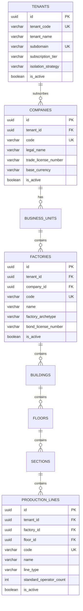
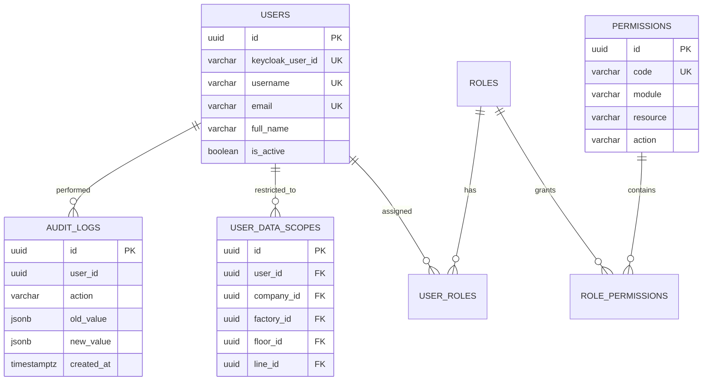

# 🗄️ থ্রেডফ্লো কোর ডেটাবেজ স্কিমা ও এনটিটি ডিকশনারি স্পেসিফিকেশন
### *ThreadFlow ERP Core Database Schema, Organizational Hierarchy & 7-Tier Security Models*

- **ডকুমেন্ট আইডি**: `TF-DOC-011-CORE-DATABASE-SCHEMAS`
- **প্রণেতা**: 🗄️ ফাহিম (Database Architect), 🏛️ তানভীর (Principal Architect), ⚡ আসিফ (Backend Lead), 🛡️ মায়া (QA & Security)
- **অনুমোদনকারী**: 👑 বস (Founder / CTO / Head of Engineering)
- **টার্গেট আরডিবিএমএস**: PostgreSQL 16+ (UUIDv7, GIN, B-Tree, Declarative Range Partitioning)
- **ওআরএম ও ডেটা এক্সেস**: EF Core 10 (Writes & Aggregates) + Dapper (Optimized Reads)
- **স্ট্যাটাস**: **অফিসিয়াল আর্কিটেকচারাল সোর্স অব ট্রুথ (Baseline)** | **ভার্সন**: 1.0.0

---

## ১. ভূমিকা ও ডেটাবেজ আর্কিটেকচারাল সংবিধান

একটি পোশাক প্রস্তুতকারী এন্টারপ্রাইজ গ্রুপের জন্য ডেটাবেজ ইন্টিগ্রিটি হলো সর্বোচ্চ অগ্রাধিকার। কোনো অ্যাপ্লিকেশনের বাগ যেন ডেটাবেজের ক্ষতি করতে না পারে, সেজন্য সিস্টেমের আর্কিটেকচারাল সংবিধান:

1. **প্রাইমারি কি স্ট্যান্ডার্ড**: সমস্ত টেবিলে আধুনিক **UUIDv7 (RFC 9562 - Time-Ordered UUID)** প্রাইমারি কি (`id UUID PRIMARY KEY DEFAULT uuid_generate_v7()`)। কোনো অটো-ইনক্রিমেন্ট ইন্টিজার বা আন-সর্টেড UUIDv4 নিষিদ্ধ।
2. **নেমিং কনভেনশন**: টেবিলের নাম এবং কলামের নাম শতভাগ **snake_case** এবং প্লুরাল টেবিল নেম (`companies`, `factories`, `production_lines`)।
3. **অলঙ্ঘনীয় জিরো-ফ্লোট নীতি**: অর্থ, মুদ্রা এক্সচেঞ্জ রেট এবং কাপড়ের কনসাম্পশনে `FLOAT` বা `REAL` সম্পূর্ণ নিষিদ্ধ। বাধ্যতামূলক `DECIMAL(12, 4)`, `DECIMAL(14, 4)`, বা `DECIMAL(18, 4)`।
4. **টাইমস্ট্যাম্প নীতি**: تمام টাইমস্ট্যাম্প বাধ্যতামূলকভাবে `TIMESTAMPTZ` (UTC) এবং `clock_timestamp()` ডিফল্ট।
5. **ফরেনসিক অডিট কলামসমূহ**: প্রতিটি কোর টেবিলে `created_at`, `created_by`, `updated_at`, `updated_by`, `is_deleted`, `deleted_at`, এবং কনকারেন্সি টোকেন `xmin XID` বাধ্যতামূলক।

---

## ২. কোর মাল্টি-টেন্যান্ট ও অর্গানাইজেশনাল হায়ারার্কি স্কিমা (8-Tier Spatial Topology)

পোশাক শিল্পের আধুনিক ক্লাউড SaaS ও এন্টারপ্রাইজ অন-প্রিমিস সমন্বিত ৮-লেয়ার ভৌগোলিক ও প্রাতিষ্ঠানিক হায়ারার্কি:
$$\mathbf{Tenant} \longrightarrow \mathbf{Company} \longrightarrow \mathbf{Business \ Unit} \longrightarrow \mathbf{Factory} \longrightarrow \mathbf{Building} \longrightarrow \mathbf{Floor} \longrightarrow \mathbf{Section} \longrightarrow \mathbf{Line}$$



### ২.১ SQL DDL: টেন্যান্ট ও অর্গানাইজেশনাল টেবিলসমূহ
```sql
-- ০. রুট টেন্যান্ট সাবস্ক্রিপশন টেবিল (The SaaS Layer)
CREATE TABLE tenants (
    id UUID PRIMARY KEY DEFAULT uuid_generate_v7(),
    tenant_code VARCHAR(32) UNIQUE NOT NULL,      -- 'APEX_GROUP', 'HA_MEEM', 'FASHION_TEX'
    tenant_name VARCHAR(256) NOT NULL,
    subdomain VARCHAR(64) UNIQUE NOT NULL,        -- 'apex', 'hameem', 'fashiontex'
    custom_domain VARCHAR(256) UNIQUE,            -- 'erp.apexapparel.com'
    subscription_tier VARCHAR(32) NOT NULL DEFAULT 'ENTERPRISE', -- 'STARTER', 'GROWTH', 'ENTERPRISE'
    subscription_status VARCHAR(32) NOT NULL DEFAULT 'ACTIVE',   -- 'TRIAL', 'ACTIVE', 'PAST_DUE', 'SUSPENDED'
    isolation_strategy VARCHAR(32) NOT NULL DEFAULT 'SHARED_ROW_LEVEL', -- 'SHARED_ROW_LEVEL', 'DEDICATED_DATABASE'
    dedicated_connection_string TEXT,            -- Nullable: VIP ক্লায়েন্টদের জন্য আলাদা ডেটাবেজ কানেকশন
    max_factories INT NOT NULL DEFAULT 5,
    max_lines INT NOT NULL DEFAULT 50,
    max_active_users INT NOT NULL DEFAULT 200,
    primary_contact_name VARCHAR(128) NOT NULL,
    primary_contact_email VARCHAR(256) NOT NULL,
    primary_contact_phone VARCHAR(32),
    is_active BOOLEAN NOT NULL DEFAULT TRUE,
    created_at TIMESTAMPTZ NOT NULL DEFAULT clock_timestamp(),
    created_by UUID,
    updated_at TIMESTAMPTZ NOT NULL DEFAULT clock_timestamp(),
    updated_by UUID,
    is_deleted BOOLEAN NOT NULL DEFAULT FALSE,
    deleted_at TIMESTAMPTZ,
    xmin XID NOT NULL
);

-- ১. এন্টারপ্রাইজ কোম্পানি / কংগ্লোমারেট গ্রুপ
CREATE TABLE companies (
    id UUID PRIMARY KEY DEFAULT uuid_generate_v7(),
    tenant_id UUID NOT NULL REFERENCES tenants(id) ON DELETE RESTRICT,
    code VARCHAR(32) NOT NULL,
    legal_name VARCHAR(256) NOT NULL,
    trade_license_number VARCHAR(128),
    vat_bin_number VARCHAR(64),
    tin_number VARCHAR(64),
    registered_address TEXT NOT NULL,
    base_currency VARCHAR(3) NOT NULL DEFAULT 'BDT',
    is_active BOOLEAN NOT NULL DEFAULT TRUE,
    created_at TIMESTAMPTZ NOT NULL DEFAULT clock_timestamp(),
    created_by UUID NOT NULL,
    updated_at TIMESTAMPTZ NOT NULL DEFAULT clock_timestamp(),
    updated_by UUID NOT NULL,
    is_deleted BOOLEAN NOT NULL DEFAULT FALSE,
    deleted_at TIMESTAMPTZ,
    xmin XID NOT NULL,
    CONSTRAINT uq_companies_tenant_code UNIQUE (tenant_id, code)
);

-- ২. বিজনেস ইউনিট / ডিভিশন
CREATE TABLE business_units (
    id UUID PRIMARY KEY DEFAULT uuid_generate_v7(),
    tenant_id UUID NOT NULL REFERENCES tenants(id) ON DELETE RESTRICT,
    company_id UUID NOT NULL REFERENCES companies(id) ON DELETE RESTRICT,
    code VARCHAR(32) NOT NULL,
    name VARCHAR(128) NOT NULL,
    is_active BOOLEAN NOT NULL DEFAULT TRUE,
    created_at TIMESTAMPTZ NOT NULL DEFAULT clock_timestamp(),
    created_by UUID NOT NULL,
    updated_at TIMESTAMPTZ NOT NULL DEFAULT clock_timestamp(),
    updated_by UUID NOT NULL,
    is_deleted BOOLEAN NOT NULL DEFAULT FALSE,
    deleted_at TIMESTAMPTZ,
    xmin XID NOT NULL,
    CONSTRAINT uq_business_units_tenant_company_code UNIQUE (tenant_id, company_id, code)
);

-- ৩. ফ্যাক্টরি ক্যাম্পাস / প্রোডাকশন ইউনিট
CREATE TABLE factories (
    id UUID PRIMARY KEY DEFAULT uuid_generate_v7(),
    tenant_id UUID NOT NULL REFERENCES tenants(id) ON DELETE RESTRICT,
    company_id UUID NOT NULL REFERENCES companies(id) ON DELETE RESTRICT,
    business_unit_id UUID REFERENCES business_units(id) ON DELETE RESTRICT,
    code VARCHAR(32) NOT NULL,
    name VARCHAR(128) NOT NULL,
    factory_archetype VARCHAR(32) NOT NULL, -- 'KNIT_DEDICATED', 'WOVEN_DEDICATED', 'DENIM_DEDICATED', etc.
    bond_license_number VARCHAR(128),
    bgmea_bkmea_reg_number VARCHAR(128),
    fire_license_number VARCHAR(128),
    address TEXT NOT NULL,
    latitude DECIMAL(10, 7),
    longitude DECIMAL(10, 7),
    is_active BOOLEAN NOT NULL DEFAULT TRUE,
    created_at TIMESTAMPTZ NOT NULL DEFAULT clock_timestamp(),
    created_by UUID NOT NULL,
    updated_at TIMESTAMPTZ NOT NULL DEFAULT clock_timestamp(),
    updated_by UUID NOT NULL,
    is_deleted BOOLEAN NOT NULL DEFAULT FALSE,
    deleted_at TIMESTAMPTZ,
    xmin XID NOT NULL,
    CONSTRAINT uq_factories_tenant_company_code UNIQUE (tenant_id, company_id, code)
);

-- ৪. বিল্ডিং / শেড
CREATE TABLE buildings (
    id UUID PRIMARY KEY DEFAULT uuid_generate_v7(),
    tenant_id UUID NOT NULL REFERENCES tenants(id) ON DELETE RESTRICT,
    factory_id UUID NOT NULL REFERENCES factories(id) ON DELETE RESTRICT,
    code VARCHAR(32) NOT NULL,
    name VARCHAR(128) NOT NULL,
    total_floors INT NOT NULL DEFAULT 1,
    is_active BOOLEAN NOT NULL DEFAULT TRUE,
    created_at TIMESTAMPTZ NOT NULL DEFAULT clock_timestamp(),
    created_by UUID NOT NULL,
    updated_at TIMESTAMPTZ NOT NULL DEFAULT clock_timestamp(),
    updated_by UUID NOT NULL,
    is_deleted BOOLEAN NOT NULL DEFAULT FALSE,
    deleted_at TIMESTAMPTZ,
    xmin XID NOT NULL,
    CONSTRAINT uq_buildings_tenant_factory_code UNIQUE (tenant_id, factory_id, code)
);

-- ৫. ফ্লোর
CREATE TABLE floors (
    id UUID PRIMARY KEY DEFAULT uuid_generate_v7(),
    tenant_id UUID NOT NULL REFERENCES tenants(id) ON DELETE RESTRICT,
    building_id UUID NOT NULL REFERENCES buildings(id) ON DELETE RESTRICT,
    factory_id UUID NOT NULL REFERENCES factories(id) ON DELETE RESTRICT,
    floor_number INT NOT NULL,
    code VARCHAR(32) NOT NULL,
    name VARCHAR(128) NOT NULL,
    floor_type VARCHAR(32) NOT NULL, -- 'CUTTING', 'SEWING', 'FINISHING', 'STORE', 'OFFICE'
    is_active BOOLEAN NOT NULL DEFAULT TRUE,
    created_at TIMESTAMPTZ NOT NULL DEFAULT clock_timestamp(),
    created_by UUID NOT NULL,
    updated_at TIMESTAMPTZ NOT NULL DEFAULT clock_timestamp(),
    updated_by UUID NOT NULL,
    is_deleted BOOLEAN NOT NULL DEFAULT FALSE,
    deleted_at TIMESTAMPTZ,
    xmin XID NOT NULL,
    CONSTRAINT uq_floors_tenant_building_code UNIQUE (tenant_id, building_id, code)
);

-- ৬. সেকশন / জোন
CREATE TABLE sections (
    id UUID PRIMARY KEY DEFAULT uuid_generate_v7(),
    tenant_id UUID NOT NULL REFERENCES tenants(id) ON DELETE RESTRICT,
    floor_id UUID NOT NULL REFERENCES floors(id) ON DELETE RESTRICT,
    factory_id UUID NOT NULL REFERENCES factories(id) ON DELETE RESTRICT,
    code VARCHAR(32) NOT NULL,
    name VARCHAR(128) NOT NULL,
    section_type VARCHAR(32) NOT NULL, -- 'SEWING_SECTION', 'QC_SECTION', 'PACKING_SECTION'
    is_active BOOLEAN NOT NULL DEFAULT TRUE,
    created_at TIMESTAMPTZ NOT NULL DEFAULT clock_timestamp(),
    created_by UUID NOT NULL,
    updated_at TIMESTAMPTZ NOT NULL DEFAULT clock_timestamp(),
    updated_by UUID NOT NULL,
    is_deleted BOOLEAN NOT NULL DEFAULT FALSE,
    deleted_at TIMESTAMPTZ,
    xmin XID NOT NULL,
    CONSTRAINT uq_sections_tenant_floor_code UNIQUE (tenant_id, floor_id, code)
);

-- ৭. প্রোডাকশন লাইন / সুইং লাইন
CREATE TABLE production_lines (
    id UUID PRIMARY KEY DEFAULT uuid_generate_v7(),
    tenant_id UUID NOT NULL REFERENCES tenants(id) ON DELETE RESTRICT,
    section_id UUID NOT NULL REFERENCES sections(id) ON DELETE RESTRICT,
    floor_id UUID NOT NULL REFERENCES floors(id) ON DELETE RESTRICT,
    factory_id UUID NOT NULL REFERENCES factories(id) ON DELETE RESTRICT,
    code VARCHAR(32) NOT NULL,
    name VARCHAR(128) NOT NULL,
    line_type VARCHAR(32) NOT NULL DEFAULT 'SEWING', -- 'SEWING', 'IRONING', 'PACKING'
    standard_operator_count INT NOT NULL DEFAULT 40,
    standard_helper_count INT NOT NULL DEFAULT 10,
    standard_daily_working_hours DECIMAL(4, 2) NOT NULL DEFAULT 8.00,
    andon_display_device_id VARCHAR(128),
    is_active BOOLEAN NOT NULL DEFAULT TRUE,
    created_at TIMESTAMPTZ NOT NULL DEFAULT clock_timestamp(),
    created_by UUID NOT NULL,
    updated_at TIMESTAMPTZ NOT NULL DEFAULT clock_timestamp(),
    updated_by UUID NOT NULL,
    is_deleted BOOLEAN NOT NULL DEFAULT FALSE,
    deleted_at TIMESTAMPTZ,
    xmin XID NOT NULL,
    CONSTRAINT uq_lines_tenant_factory_code UNIQUE (tenant_id, factory_id, code)
);
```

---

## ৩. আইডেন্টিটি, ফাইন-গ্রেইনড পারমিশন ও ৭-লেয়ার ডেটা স্কোপ স্কিমা



### ৩.১ SQL DDL: সিকিউরিটি ও ডেটা স্কোপ টেবিলসমূহ
```sql
-- ১. লোকাল ইউজার মিরর টেবিল (Keycloak OIDC সিঙ্ক)
CREATE TABLE users (
    id UUID PRIMARY KEY DEFAULT uuid_generate_v7(),
    tenant_id UUID NOT NULL REFERENCES tenants(id) ON DELETE RESTRICT,
    keycloak_user_id VARCHAR(64) UNIQUE NOT NULL, -- Subject Claim (sub) from Keycloak JWT
    username VARCHAR(64) NOT NULL,
    email VARCHAR(256) NOT NULL,
    full_name VARCHAR(128) NOT NULL,
    phone_number VARCHAR(32),
    default_company_id UUID REFERENCES companies(id) ON DELETE SET NULL,
    default_factory_id UUID REFERENCES factories(id) ON DELETE SET NULL,
    is_super_admin BOOLEAN NOT NULL DEFAULT FALSE,
    is_active BOOLEAN NOT NULL DEFAULT TRUE,
    created_at TIMESTAMPTZ NOT NULL DEFAULT clock_timestamp(),
    created_by UUID,
    updated_at TIMESTAMPTZ NOT NULL DEFAULT clock_timestamp(),
    updated_by UUID,
    is_deleted BOOLEAN NOT NULL DEFAULT FALSE,
    deleted_at TIMESTAMPTZ,
    xmin XID NOT NULL,
    CONSTRAINT uq_users_tenant_username UNIQUE (tenant_id, username),
    CONSTRAINT uq_users_tenant_email UNIQUE (tenant_id, email)
);

-- ২. এন্টারপ্রাইজ রোলস
CREATE TABLE roles (
    id UUID PRIMARY KEY DEFAULT uuid_generate_v7(),
    tenant_id UUID REFERENCES tenants(id) ON DELETE CASCADE, -- NULL = System-wide global template role
    code VARCHAR(64) NOT NULL,
    name VARCHAR(128) NOT NULL,
    description TEXT,
    is_system_role BOOLEAN NOT NULL DEFAULT FALSE,
    is_active BOOLEAN NOT NULL DEFAULT TRUE,
    created_at TIMESTAMPTZ NOT NULL DEFAULT clock_timestamp(),
    created_by UUID,
    updated_at TIMESTAMPTZ NOT NULL DEFAULT clock_timestamp(),
    updated_by UUID,
    is_deleted BOOLEAN NOT NULL DEFAULT FALSE,
    deleted_at TIMESTAMPTZ,
    xmin XID NOT NULL,
    CONSTRAINT uq_roles_tenant_code UNIQUE (tenant_id, code)
);

-- ৩. ফাইন-গ্রেইনড পারমিশন ক্যাটালগ
CREATE TABLE permissions (
    id UUID PRIMARY KEY DEFAULT uuid_generate_v7(),
    code VARCHAR(128) UNIQUE NOT NULL, -- 'merchandising.order.create', 'cutting.plan.approve'
    module VARCHAR(64) NOT NULL,       -- 'merchandising', 'cutting', 'sewing'
    resource VARCHAR(64) NOT NULL,     -- 'order', 'plan', 'bundle', 'output'
    action VARCHAR(32) NOT NULL,       -- 'view', 'create', 'edit', 'approve', 'export'
    display_name VARCHAR(128) NOT NULL,
    description TEXT,
    created_at TIMESTAMPTZ NOT NULL DEFAULT clock_timestamp()
);

-- ৪. রোল-পারমিশন ম্যাপিং
CREATE TABLE role_permissions (
    role_id UUID NOT NULL REFERENCES roles(id) ON DELETE CASCADE,
    permission_id UUID NOT NULL REFERENCES permissions(id) ON DELETE CASCADE,
    created_at TIMESTAMPTZ NOT NULL DEFAULT clock_timestamp(),
    created_by UUID,
    PRIMARY KEY (role_id, permission_id)
);

-- ৫. ইউজার-রোল ম্যাপিং
CREATE TABLE user_roles (
    tenant_id UUID NOT NULL REFERENCES tenants(id) ON DELETE CASCADE,
    user_id UUID NOT NULL REFERENCES users(id) ON DELETE CASCADE,
    role_id UUID NOT NULL REFERENCES roles(id) ON DELETE CASCADE,
    assigned_at TIMESTAMPTZ NOT NULL DEFAULT clock_timestamp(),
    assigned_by UUID NOT NULL,
    PRIMARY KEY (user_id, role_id)
);

-- ৬. ৮-লেয়ার ইউজার ডেটা স্কোপ রেস্ট্রিকশন
CREATE TABLE user_data_scopes (
    id UUID PRIMARY KEY DEFAULT uuid_generate_v7(),
    tenant_id UUID NOT NULL REFERENCES tenants(id) ON DELETE CASCADE,
    user_id UUID NOT NULL REFERENCES users(id) ON DELETE CASCADE,
    company_id UUID NOT NULL REFERENCES companies(id) ON DELETE CASCADE,
    factory_id UUID REFERENCES factories(id) ON DELETE CASCADE,
    building_id UUID REFERENCES buildings(id) ON DELETE CASCADE,
    floor_id UUID REFERENCES floors(id) ON DELETE CASCADE,
    section_id UUID REFERENCES sections(id) ON DELETE CASCADE,
    line_id UUID REFERENCES production_lines(id) ON DELETE CASCADE,
    is_active BOOLEAN NOT NULL DEFAULT TRUE,
    created_at TIMESTAMPTZ NOT NULL DEFAULT clock_timestamp(),
    created_by UUID NOT NULL,
    updated_at TIMESTAMPTZ NOT NULL DEFAULT clock_timestamp(),
    updated_by UUID NOT NULL,
    xmin XID NOT NULL
);

-- ৭. ফরেনসিক ইমিউটেবল অডিট লগ (Partitioned by Month/Year)
CREATE TABLE audit_logs (
    id UUID DEFAULT uuid_generate_v7(),
    tenant_id UUID NOT NULL REFERENCES tenants(id) ON DELETE CASCADE,
    user_id UUID NOT NULL,
    action VARCHAR(64) NOT NULL,           -- 'CREATE', 'UPDATE', 'DELETE', 'APPROVE', 'REJECT'
    module VARCHAR(64) NOT NULL,           -- 'merchandising', 'cutting', 'finance'
    resource_type VARCHAR(64) NOT NULL,    -- 'order', 'cutting_plan', 'payment_voucher'
    resource_id UUID NOT NULL,
    old_value JSONB,
    new_value JSONB,
    ip_address VARCHAR(45) NOT NULL,
    user_agent TEXT,
    correlation_id VARCHAR(64) NOT NULL,
    created_at TIMESTAMPTZ NOT NULL DEFAULT clock_timestamp(),
    PRIMARY KEY (id, created_at)
) PARTITION BY RANGE (created_at);

-- অডিট লগ ২০২৬ ইনিশিয়াল পার্টিশন
CREATE TABLE audit_logs_2026_q4 PARTITION OF audit_logs
    FOR VALUES FROM ('2026-10-01 00:00:00+00') TO ('2027-01-01 00:00:00+00');
```

---

## ৪. ডাইনামিক কনফিগারেশন, কোড জেনারেটর ও UI লেবেল ইঞ্জিন

```sql
-- ১. ডায়নামিক UI লেবেল ডিকশনারি (বসের ডিরেক্টিভ ৫: Admin UI Label Customization)
CREATE TABLE ui_label_dictionaries (
    id UUID PRIMARY KEY DEFAULT uuid_generate_v7(),
    tenant_id UUID NOT NULL REFERENCES tenants(id) ON DELETE CASCADE,
    company_id UUID REFERENCES companies(id) ON DELETE CASCADE,
    screen_code VARCHAR(64) NOT NULL,      -- 'SCREEN_COSTING_SHEET', 'SCREEN_CUTTING_PLAN'
    element_key VARCHAR(64) NOT NULL,      -- 'BTN_APPROVE', 'LBL_FABRIC_CONSUMPTION'
    default_text VARCHAR(128) NOT NULL,    -- 'Approve Costing'
    custom_label VARCHAR(128) NOT NULL,    -- 'Sign-off Pricing'
    tooltip_text VARCHAR(256),
    placeholder_text VARCHAR(128),
    is_visible BOOLEAN NOT NULL DEFAULT TRUE,
    updated_at TIMESTAMPTZ NOT NULL DEFAULT clock_timestamp(),
    updated_by UUID NOT NULL,
    xmin XID NOT NULL,
    CONSTRAINT uq_ui_labels_tenant_screen_element UNIQUE (tenant_id, screen_code, element_key)
);

-- ২. ডায়নামিক অটো-কোড ও সিকোয়েন্স ইঞ্জিন (বসের ডিরেক্টিভ ৪: Dynamic Auto-Codes)
CREATE TABLE code_sequence_definitions (
    id UUID PRIMARY KEY DEFAULT uuid_generate_v7(),
    tenant_id UUID NOT NULL REFERENCES tenants(id) ON DELETE CASCADE,
    company_id UUID NOT NULL REFERENCES companies(id) ON DELETE CASCADE,
    entity_type VARCHAR(64) NOT NULL,      -- 'STYLE', 'PO', 'CUT_ORDER', 'INVOICE'
    prefix VARCHAR(16) NOT NULL,           -- 'TF-STY-', 'PO-2026-'
    suffix VARCHAR(16),
    date_format VARCHAR(16),               -- 'YYYY', 'YYYYMM', 'YY'
    padding_zeros INT NOT NULL DEFAULT 5,  -- 00001
    current_number BIGINT NOT NULL DEFAULT 0,
    reset_frequency VARCHAR(16) NOT NULL DEFAULT 'YEARLY', -- 'YEARLY', 'MONTHLY', 'NEVER'
    last_reset_date DATE,
    sample_preview VARCHAR(64) NOT NULL,
    is_active BOOLEAN NOT NULL DEFAULT TRUE,
    updated_at TIMESTAMPTZ NOT NULL DEFAULT clock_timestamp(),
    updated_by UUID NOT NULL,
    xmin XID NOT NULL,
    CONSTRAINT uq_code_sequences_tenant_company_entity UNIQUE (tenant_id, company_id, entity_type)
);

-- ৩. গ্লোবাল সিস্টেম লুকআপস (Zero Hardcoding Law)
CREATE TABLE system_lookups (
    id UUID PRIMARY KEY DEFAULT uuid_generate_v7(),
    tenant_id UUID REFERENCES tenants(id) ON DELETE CASCADE, -- NULL = Global default options
    company_id UUID REFERENCES companies(id) ON DELETE CASCADE,
    category VARCHAR(64) NOT NULL,         -- 'GARMENT_TYPE', 'WASH_TYPE', 'FABRIC_COMPOSITION'
    lookup_code VARCHAR(64) NOT NULL,
    lookup_value VARCHAR(128) NOT NULL,
    display_order INT NOT NULL DEFAULT 0,
    is_system_locked BOOLEAN NOT NULL DEFAULT FALSE,
    is_active BOOLEAN NOT NULL DEFAULT TRUE,
    created_at TIMESTAMPTZ NOT NULL DEFAULT clock_timestamp(),
    created_by UUID,
    CONSTRAINT uq_system_lookups_tenant_category_code UNIQUE (tenant_id, category, lookup_code)
);

-- ৪. ইউনিট অব মেজারমেন্ট (UOM Registry - Global System Standards)
CREATE TABLE uom_registries (
    id UUID PRIMARY KEY DEFAULT uuid_generate_v7(),
    code VARCHAR(16) UNIQUE NOT NULL,      -- 'PCS', 'DZN', 'KG', 'YDS', 'MTR', 'CONE'
    name VARCHAR(64) NOT NULL,
    category VARCHAR(32) NOT NULL,         -- 'COUNT', 'WEIGHT', 'LENGTH', 'VOLUME'
    base_uom_id UUID REFERENCES uom_registries(id),
    conversion_multiplier DECIMAL(14, 6) DEFAULT 1.000000,
    is_active BOOLEAN NOT NULL DEFAULT TRUE,
    created_at TIMESTAMPTZ NOT NULL DEFAULT clock_timestamp()
);
```

---

## ৫. হাই-পারফরম্যান্স মাল্টি-টেন্যান্ট ইনডেক্সিং পলিসি

1. **টেন্যান্ট ও অর্গানাইজেশনাল ইনডেক্সিং**:
   ```sql
   CREATE INDEX idx_companies_tenant_id ON companies(tenant_id);
   CREATE INDEX idx_business_units_tenant_company ON business_units(tenant_id, company_id);
   CREATE INDEX idx_factories_tenant_company ON factories(tenant_id, company_id);
   CREATE INDEX idx_buildings_tenant_factory ON buildings(tenant_id, factory_id);
   CREATE INDEX idx_floors_tenant_building ON floors(tenant_id, building_id);
   CREATE INDEX idx_sections_tenant_floor ON sections(tenant_id, floor_id);
   CREATE INDEX idx_production_lines_tenant_section ON production_lines(tenant_id, section_id);
   CREATE INDEX idx_production_lines_tenant_factory ON production_lines(tenant_id, factory_id);
   ```
2. **ইউজার, ডেটা স্কোপ ও অডিট ইনডেক্সিং**:
   ```sql
   CREATE INDEX idx_users_tenant_id ON users(tenant_id);
   CREATE INDEX idx_user_data_scopes_tenant_user ON user_data_scopes(tenant_id, user_id, company_id, factory_id);
   CREATE INDEX idx_audit_logs_tenant_resource ON audit_logs(tenant_id, resource_type, resource_id);
   CREATE INDEX idx_audit_logs_tenant_user_date ON audit_logs(tenant_id, user_id, created_at DESC);
   ```

---

## ৬. আর্কিটেকচারাল কমপ্লায়েন্স ও সাইন-অফ

এই কোর স্কিমা স্পেসিফিকেশনটি:
1. **বসের ১২টি অলঙ্ঘনীয় মূলনীতি** (জিরো হার্ডকোডিং, ডায়নামিক ইউআই লেবেল, টাইম-অর্ডার্ড UUIDv7) ১০০% সমর্থন করে।
2. **Technology Stack SRS**-এর ৭-লেয়ার ডেটা স্কোপ ফিল্টারিং এবং Keycloak ইন্টিগ্রেশন মডেল বাস্তবায়নের জন্য তৈরি।
3. C# EF Core 10 Fluent API কনফিগারেশনের সাথে সম্পূর্ণ সামঞ্জস্যপূর্ণ।
