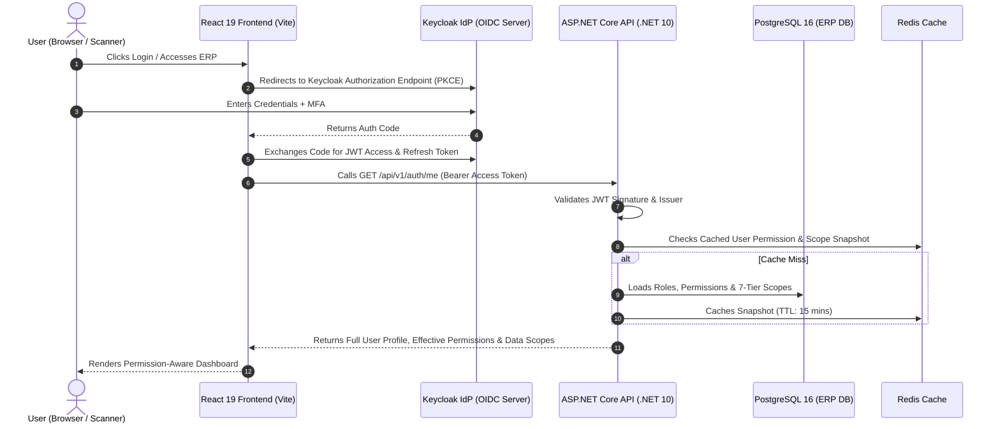
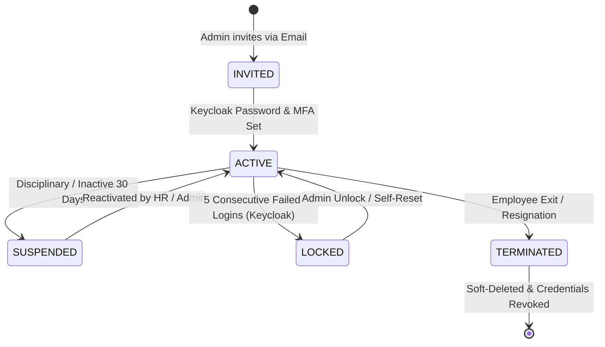

# 🔐 থ্রেডফ্লো অথেন্টিকেশন, ইউজার ম্যানেজমেন্ট, রোল-পলিসি ও মাস্টার ডেটা স্পেসিফিকেশন
### *ThreadFlow Enterprise Identity, 7-Tier Authorization, Policy Engine & Master Data Specification*

- **ডকুমেন্ট আইডি**: `TF-DOC-012-AUTH-USERS-ROLES-MASTER-DATA`
- **প্রণেতা**: 📋 নাবিলা (Lead BA), 🏛️ তানভীর (Principal Architect), ⚡ আসিফ (Backend Lead), 🛡️ মায়া (QA & Security)
- **অনুমোদনকারী**: 👑 বস (Founder / CTO / Head of Engineering)
- **স্ট্যাটাস**: **অফিসিয়াল আর্কিটেকচারাল ও ফাংশনাল স্পেসিফিকেশন (Baseline)** | **ভার্সন**: 1.0.0

---

## ১. ভূমিকা ও ডোমেন ওভারভিউ (Domain Scope)

পোশাক শিল্পের মতো হাই-ভলিউম জটিল ম্যানুফ্যাকচারিং পরিবেশে সিকিউরিটি, অ্যাক্সেস কন্ট্রোল এবং মাস্টার ডেটা হলো পুরো ইআরপি-র মেরুদণ্ড। 
এই স্পেসিফিকেশনের মূল উদ্দেশ্য:
1. **সেন্ট্রালাইজড আইডেন্টিটি ও এসএসও (SSO)**: Keycloak (OIDC/OAuth 2.0) দিয়ে নিরাপদ ও স্ট্যান্ডার্ড অথেন্টিকেশন।
2. **ইউজার লাইফসাইকেল ও স্কোপ প্রোভিশনিং**: কর্মী বা ম্যানেজারের দায়িত্ব অনুযায়ী কারখানার সুনির্দিষ্ট ফ্লোর ও লাইনে অ্যাক্সেস সীমাবদ্ধ করা।
3. **ফাইন-গ্রেইনড রোল ও পারমিশন ম্যাট্রিক্স**: `<module>.<resource>.<action>` ট্যাক্সোনমিতে ৩,০০০+ গ্র্যানুলার পারমিশন পরিচালনা।
4. **৭-লেয়ার ডেটা স্কোপ ইঞ্জিন**: $\text{Company} \rightarrow \text{Factory} \rightarrow \text{Building} \rightarrow \text{Floor} \rightarrow \text{Section} \rightarrow \text{Line}$ লেভেলে স্বয়ংক্রিয় ব্যাকএন্ড কুয়েরি ফিল্টারিং।
5. **ডায়নামিক বিজনেস পলিসি ইঞ্জিন**: Segregation of Duties (Creator $\neq$ Approver) এবং অ্যামাউন্ট-ভিত্তিক অনুমোদন লিমিট।
6. **মাস্টার ডেটা হাব (The Single Source of Truth)**: বায়ার, ব্র্যান্ড, সিজন, ইনকোটার্মস, কারেন্সি, ইউওএম (UOM) ও ডাইনামিক সিকোয়েন্স ইঞ্জিনের কেন্দ্রীয় ব্যবস্থাপনা।

---

## ২. অথেন্টিকেশন ও সেশন লাইফসাইকেল (Keycloak OIDC Integration)

### ২.১ অথেন্টিকেশন আর্কিটেকচার ও টোকেন ফ্লো


### ২.২ টোকেন স্পেসিফিকেশন ও সেশন পলিসি
- **Access Token (JWT)**:
  - মেয়াদ: **১৫ মিনিট**।
  - অ্যালগরিদম: `RS256` (Asymmetric RSA Signature with Keycloak Public Key)।
  - ক্লেইমস (Claims): `sub` (Keycloak User UUID), `email`, `preferred_username`, `name`, `roles` (Global Realm Roles)।
- **Refresh Token**:
  - মেয়াদ: **৮ ঘণ্টা** (অ্যাক্টিভ শিফট) বা **৭ দিন** (অফিস ম্যানেজমেন্ট)।
  - স্টোরেজ: সিকিউর `httpOnly, SameSite=Strict, Secure` কুকি।
- **টোকেন ব্ল্যাকলিস্টিং ও ফোর্সড সেশন কিল**:
  - ইউজার সাসপেন্ড হলে বা পাসওয়ার্ড চেঞ্জ হলে Keycloak ব্যাক-চ্যানেল লগআউট ইভেন্ট পাঠাবে এবং ASP.NET Core সাথে সাথে Redis-এর পারমিশন ক্যাশ ফ্লাশ করবে।

---

## ৩. ইউজার ম্যানেজমেন্ট ও লাইফসাইকেল ইঞ্জিন (User Management)

### ৩.১ ইউজার স্টেট মেশিন (User Lifecycle State Machine)


### ৩.২ ইউজার প্রফাইল ও অর্গানাইজেশনাল বাইন্ডিং
প্রতিটি ইউজারের লোকাল ডেটাবেজে একটি রিলেশনাল প্রোফাইল থাকবে:
- **Core Identity**: `keycloak_user_id` (UUID), `username`, `email`, `full_name`, `phone_number`।
- **Default Organization**: `default_company_id`, `default_factory_id` (লগইন করার পর ডিফল্ট ভিউ)।
- **Audit Fields**: `created_at`, `created_by`, `updated_at`, `updated_by`, `is_active`, `is_deleted`।

---

## ৪. ফাইন-গ্রেইনড রোল ও পারমিশন ট্যাক্সোনমি (RBAC Model)

### ৪.১ পারমিশন নেমিং স্ট্যান্ডার্ড
$$\mathbf{\langle module\rangle.\langle resource\rangle.\langle action\rangle}$$

1. **স্ট্যান্ডার্ড অ্যাকশন ক্যাটালগ**:
   - `view`: তালিকা ও বিস্তারিত দেখার অনুমতি।
   - `create`: নতুন ড্রাফট রেকর্ড তৈরির অনুমতি।
   - `edit`: বিদ্যমান রেকর্ড এডিটের অনুমতি।
   - `delete`: রেকর্ড সফট-ডিলিট করার অনুমতি।
   - `approve`: বিজনেস ডকুমেন্ট চূড়ান্ত অনুমোদন দেওয়ার অনুমতি।
   - `reject`: ডকুমেন্ট রিজেক্ট বা ব্যাক-টু-রিভিশন পাঠানোর অনুমতি।
   - `export`: এক্সেল, সিএসভি বা পিডিএফ এক্সপোর্টের অনুমতি।
   - `print`: বারকোড স্টিকার, কাটিং লেবেল বা চালান প্রিন্ট করার অনুমতি।

2. **ডোমেন-ভিত্তিক পারমিশন ক্লাস্টার উদাহরণ**:
   ```
   merchandising
     ├── merchandising.style.view
     ├── merchandising.style.create
     ├── merchandising.style.edit
     ├── merchandising.costing.create
     ├── merchandising.costing.approve    <-- Critical Financial Permission
     └── merchandising.bom.approve

   cutting
     ├── cutting.plan.view
     ├── cutting.plan.create
     ├── cutting.plan.approve
     ├── cutting.bundle.create
     └── cutting.bundle.print_label

   sewing
     ├── sewing.output.view
     ├── sewing.output.log
     └── sewing.dhu.flag_defect

   admin
     ├── admin.user.view
     ├── admin.user.create
     ├── admin.role.manage
     ├── admin.scope.assign
     └── admin.lookup.edit
   ```

---

## ৫. ৮-লেয়ার মাল্টি-টেন্যান্ট ডেটা স্কোপ ইঞ্জিন (8-Tier Spatial & Tenant Data Scope)

পোশাক শিল্পের আধুনিক ক্লাউড SaaS ও এন্টারপ্রাইজ অন-প্রিমিস স্তরবিন্যাস অনুযায়ী ডেটা ফিল্টারিং:
$$\mathbf{Tenant} \longrightarrow \mathbf{Company} \longrightarrow \mathbf{Business \ Unit} \longrightarrow \mathbf{Factory} \longrightarrow \mathbf{Building} \longrightarrow \mathbf{Floor} \longrightarrow \mathbf{Section} \longrightarrow \mathbf{Line}$$

```
┌────────────────────────────────────────────────────────────────────────────────────────┐
│                          8-TIER TENANT & SPATIAL SCOPE HIERARCHY                       │
├───────────────┬──────────────────────────┬─────────────────────────────────────────────┤
│ লেভেল         │ উদাহরণ                   │ স্কোপের আওতা                                │
├───────────────┼──────────────────────────┼─────────────────────────────────────────────┤
│ Tenant (SaaS) │ Apex Holdings / DBL      │ সাবস্ক্রাইবার বা ক্লায়েন্ট এন্টারপ্রাইজ    │
│ Company       │ Apex Textile / DBL Knit  │ নির্দিষ্ট সিস্টার কনসার্ন ও সেন্ট্রাল একাউন্ট│
│ Business Unit │ Apparels Division        │ নিট বা ওভেন ডিভিশন                         │
│ Factory       │ Factory Unit 01 (Knit)   │ নির্দিষ্ট প্ল্যান্ট ক্যাম্পাস                │
│ Building      │ Building B (Production)  │ ৫-তলা প্রোডাকশন শেড                         │
│ Floor         │ Floor 03                 │ সুইং ফ্লোর ৩                                │
│ Section       │ Section East             │ কিউসি ও সুইং সেকশন                          │
│ Line          │ Line 07, Line 08         │ নির্দিষ্ট প্রোডাকশন সুইং লাইন              │
└───────────────┴──────────────────────────┴─────────────────────────────────────────────┘
```

### ৫.১ রানটাইম মাল্টি-টেন্যান্ট ডেটা স্কোপ এনফোর্সমেন্ট (Server-Side Injection)
- ইউজারের টোকেন ভ্যালিডেশনের পর `CurrentUserScopeContext`-এ তার `TenantId` এবং অ্যাসাইনড ভৌগোলিক স্কোপগুলো লোড থাকে।
- EF Core গ্লোবাল কুয়েরি ফিল্টার এবং রিপোজিটরি কোয়েরিতে স্বয়ংক্রিয়ভাবে `TenantId` এবং স্কোপ ইনজেক্ট হয়:
  ```csharp
  // EF Core Auto-Injected Tenant & Spatial Scope Filter
  public IQueryable<T> ApplyScope<T>(IQueryable<T> query, UserScope scope) where T : BaseTenantEntity
  {
      // ১. অলঙ্ঘনীয় টেন্যান্ট আইসোলেশন
      query = query.Where(x => x.TenantId == scope.TenantId);

      // ২. সুপার-অ্যাডমিন হলে টেন্যান্টের আওতাধীন সমস্ত ডেটা দেখতে পারবে
      if (scope.IsTenantSuperAdmin) return query;

      // ৩. ভৌগোলিক ও প্রাতিষ্ঠানিক ফিল্টারিং
      if (scope.CompanyId.HasValue && typeof(ICompanyScoped).IsAssignableFrom(typeof(T)))
          query = query.Where(x => ((ICompanyScoped)x).CompanyId == scope.CompanyId.Value);

      if (scope.FactoryIds.Any() && typeof(IFactoryScoped).IsAssignableFrom(typeof(T)))
          query = query.Where(x => scope.FactoryIds.Contains(((IFactoryScoped)x).FactoryId));

      if (scope.LineIds.Any() && typeof(ILineScoped).IsAssignableFrom(typeof(T)))
          query = query.Where(x => scope.LineIds.Contains(((ILineScoped)x).LineId));

      return query;
  }
  ```

---

## ৬. ডায়নামিক বিজনেস পলিসি ইঞ্জিন (Policy Engine)

অনুমোদনের জন্য শুধু পারমিশন যথেষ্ট নয়; পলিসি ইঞ্জিন নিচের শর্তগুলো মূল্যায়ন করে:

```
CanAccess(User, TenantId, Permission, Resource, Action, OrganizationContext, BusinessPolicy)
```

1. **Segregation of Duties (SoD) রুল**:
   - `CreatorId != ApproverId`
   - মার্চেন্ডাইজার যে কস্টিং বানিয়েছে, সে নিজে তা অনুমোদন দিতে পারবে না।
2. **অ্যাপ্রুভাল লিমিট ম্যাট্রিক্স (Financial & Quantity Threshold)**:
   - ফ্যাব্রিক অ্যাডজাস্টমেন্ট $\le 100$ কেজি $\rightarrow$ Store Manager অনুমোদন করতে পারেন।
   - ফ্যাব্রিক অ্যাডজাস্টমেন্ট $> 100$ কেজি $\rightarrow$ DGM / GM অনুমোদন বাধ্যতামূলক।
   - কস্টিং মার্জিন $< 8\%$ $\rightarrow$ ম্যানেজিং ডিরেক্টর (MD) অনুমোদন বাধ্যতামূলক।
3. **ওয়ার্কফ্লো স্টেট গার্ড (State Machine Guard)**:
   - কাটিং প্ল্যান অনুমোদন দেওয়া যাবে শুধুমাত্র যখন স্ট্যাটাস `SUBMITTED` এবং ফ্যাব্রিক রিলাক্সেশন `COMPLETED`।

---

## ৭. মাস্টার ডেটা ম্যানেজমেন্ট হাব (Global Reference vs Tenant-Scoped)

মাস্টার ডেটা হলো পুরো সিস্টেমের ভিত্তি। থ্রেডফ্লো আর্কিটেকচারে এটি দুই ভাগে বিভক্ত:
1. **সিস্টেম গ্লোবাল রেফারেন্স ডেটা (Shared Standards Across Tenants)**:
   - আন্তর্জাতিক কারেন্সি কোড (USD, EUR, BDT, GBP)
   - আন্তর্জাতিক UOM ক্যাটালগ (PCS, DZN, KG, YDS, MTR, CONE)
   - আন্তর্জাতিক কান্ট্রি কোড ও HS কোড লাইব্রেরি
2. **টেন্যান্ট-লেভেল আইসোলেটেড মাস্টার ডেটা (Tenant-Specific)**:
   - বায়ার ও ব্র্যান্ড তালিকা (`buyers`, `brands`)
   - বায়ার সিজন (`seasons`)
   - সাপ্লায়ার ও ভেন্ডর ক্যাটালগ (`suppliers`)
   - ডায়নামিক কোড সিকোয়েন্স ফরম্যাট (`code_sequence_definitions`)
   - কাস্টম UI লেবেল ডিকশনারি (`ui_label_dictionaries`)

---

## ৮. কোর এপিআই কন্ট্রাক্ট ও DTO স্পেসিফিকেশন

### ৮.১ `GET /api/v1/auth/me` (ইফেক্টিভ পারমিশন ও স্কোপ স্ন্যাপশট)
ফ্রন্টএন্ড লগইন করার সাথে সাথে এই এন্ডপয়েন্ট কল করে ইউজারের পুরো কনটেক্সট মেমোরিতে লোড করে:

```json
{
  "success": true,
  "statusCode": 200,
  "data": {
    "tenant": {
      "id": "01943b76-48a0-71a2-97b0-8c9e5e789000",
      "code": "APEX_GROUP",
      "name": "Apex Textile Holdings Ltd",
      "subscriptionTier": "ENTERPRISE",
      "isolationStrategy": "SHARED_ROW_LEVEL"
    },
    "user": {
      "id": "018f23a1-7c91-7f8e-bc11-a89e02a11b01",
      "username": "rahim.pm",
      "fullName": "Abdur Rahim",
      "email": "rahim@apexapparel.com",
      "defaultCompanyId": "018f23a0-1234-7abc-b111-c99e02a11001",
      "defaultFactoryId": "018f23a0-5678-7abc-b111-d99e02a11002",
      "isSuperAdmin": false
    },
    "roles": [
      {
        "code": "PRODUCTION_MANAGER",
        "name": "Production Manager"
      }
    ],
    "permissions": [
      "cutting.plan.view",
      "cutting.plan.approve",
      "cutting.bundle.view",
      "sewing.output.view",
      "sewing.output.log",
      "sewing.output.approve",
      "report.production.view",
      "report.production.export"
    ],
    "scopes": {
      "tenantId": "01943b76-48a0-71a2-97b0-8c9e5e789000",
      "companyId": "018f23a0-1234-7abc-b111-c99e02a11001",
      "allowedFactoryIds": [
        "018f23a0-5678-7abc-b111-d99e02a11002"
      ],
      "allowedBuildingIds": [
        "018f23a0-9999-7abc-b111-e99e02a11003"
      ],
      "allowedFloorIds": [
        "018f23a0-aaaa-7abc-b111-f99e02a11004"
      ],
      "allowedLineIds": [
        "018f23a0-bbbb-7abc-b111-000000000001",
        "018f23a0-bbbb-7abc-b111-000000000002",
        "018f23a0-bbbb-7abc-b111-000000000003"
      ]
    }
  },
  "meta": {
    "timestamp": "2026-10-08T18:00:00.000Z"
  }
}
```

### ৮.২ `POST /api/v1/admin/users/assign-scope` (স্কোপ অ্যাসাইনমেন্ট DTO)
```json
// Request Payload:
{
  "userId": "018f23a1-7c91-7f8e-bc11-a89e02a11b01",
  "companyId": "018f23a0-1234-7abc-b111-c99e02a11001",
  "factoryId": "018f23a0-5678-7abc-b111-d99e02a11002",
  "buildingId": "018f23a0-9999-7abc-b111-e99e02a11003",
  "floorId": "018f23a0-aaaa-7abc-b111-f99e02a11004",
  "lineIds": [
    "018f23a0-bbbb-7abc-b111-000000000001",
    "018f23a0-bbbb-7abc-b111-000000000002"
  ]
}

// Response:
{
  "success": true,
  "statusCode": 200,
  "message": "User spatial data scope updated successfully.",
  "data": {
    "scopeId": "018f23a2-cccc-7abc-b111-123456789012"
  }
}
```

### ৮.৩ `POST /api/v1/master-data/buyers` (বায়ার মাস্টার ক্রিয়েশন DTO)
```json
// Request Payload:
{
  "companyId": "018f23a0-1234-7abc-b111-c99e02a11001",
  "code": "BYR-HNM",
  "name": "H&M Hennes & Mauritz",
  "country": "SE",
  "currency": "USD",
  "defaultPaymentTerms": "60 Days Usance LC",
  "defaultIncoterm": "FOB",
  "primaryContactPerson": "Bjorn Lindqvist",
  "email": "bjorn.lindqvist@hm.com",
  "brands": [
    { "code": "HM-BASIC", "name": "H&M Basic" },
    { "code": "HM-DIVIDED", "name": "Divided" }
  ]
}

// Response:
{
  "success": true,
  "statusCode": 201,
  "message": "Buyer and associated brands registered successfully.",
  "data": {
    "buyerId": "018f23a3-dddd-7abc-b111-987654321098"
  }
}
```

---

## ৯. ফরেনসিক অডিট ও কমপ্লায়েন্স লগিং (Immutable Audit Enforcement)

1. **অডিট ট্রেইল ক্যাপচার**:
   - প্রতিটি রোল অ্যাসাইনমেন্ট, পারমিশন পরিবর্তন, ডাটা স্কোপ আপডেট এবং মাস্টার ডেটা ক্রিয়েট/এডিটে `audit_logs` টেবিলে স্বয়ংক্রিয় এন্ট্রি।
   - রেকর্ড ফরম্যাট:
     ```json
     {
       "action": "UPDATE_SCOPE",
       "module": "admin",
       "resourceType": "user_data_scopes",
       "resourceId": "018f23a2-cccc-7abc-b111-123456789012",
       "oldValue": { "lineIds": ["018f23a0-bbbb-7abc-b111-000000000001"] },
       "newValue": { "lineIds": ["018f23a0-bbbb-7abc-b111-000000000001", "018f23a0-bbbb-7abc-b111-000000000002"] },
       "ipAddress": "192.168.10.45",
       "correlationId": "00-4bf92f3577b34da6a3ce929d0e0e4736-00f067aa0ba902b7-01",
       "createdAt": "2026-10-08T18:05:12.345Z"
     }
     ```
2. **নো হার্ড ডিলিট**: মাস্টার ডেটার কোনো রেকর্ড (বায়ার, ফ্যাক্টরি, কারেন্সি) ফিজিক্যালি ড্রপ করা যাবে না; কমপ্লায়েন্সের স্বার্থে সফট-ডিলিট (`is_deleted: true`) বাধ্যতামূলক।

---

## ১০. আর্কিটেকচারাল সাইন-অফ

এই মাস্টার স্পেসিফিকেশনটি:
1. **Keycloak OIDC**, **ASP.NET Core Policy Engine**, এবং **PostgreSQL 16+ DDL**-এর মধ্যকার সংযোগ স্থাপন করে।
2. ফ্রন্টএন্ড React 19 SPA-এর জন্য `/api/v1/auth/me` রেসপন্সকে স্ট্যান্ডার্ডাইজ করে।
3. পোশাক কারখানার বাস্তব ৭-লেয়ার ভৌগোলিক স্তরবিন্যাস এবং Segregation of Duties শতভাগ সুরক্ষা দেয়।
